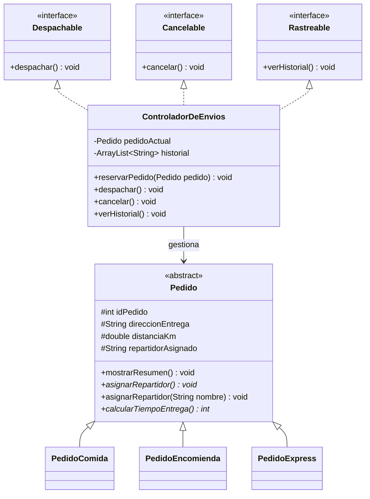

# SpeedFast - Sistema de gestión de entregas

## Actividad sumativa - Semana 3

Proyecto desarrollado en Java para la actividad **"Diseñando un sistema orientado a objetos con clases abstractas, polimorfismo e interfaces"**. El sistema simula la gestión de pedidos de comida, encomiendas y compras express de la empresa de reparto **SpeedFast**.

Esta versión integra los contenidos desarrollados durante las semanas anteriores y añade interfaces, un controlador central y un historial de operaciones.

## Integrantes

- Nicolas Sanchez Bustos

## Objetivo

Diseñar una aplicación orientada a objetos que permita:

- Crear pedidos de distintos tipos.
- Asignar repartidores de manera automática o manual.
- Calcular el tiempo estimado de entrega según las reglas de cada pedido.
- Registrar la recepción de una orden.
- Despachar o cancelar pedidos.
- Consultar el historial de operaciones realizadas.
- Aplicar abstracción, herencia, sobrecarga, sobrescritura, polimorfismo e interfaces.

## Tipos de pedido

### Pedido de comida

- Tiempo estimado: 15 minutos base más 2 minutos por kilómetro.
- Asignación automática: repartidor con mochila térmica.

### Pedido de encomienda

- Tiempo estimado: 20 minutos base más 1,5 minutos por kilómetro.
- Asignación automática: repartidor con moto o automóvil.

### Pedido express

- Tiempo estimado: 10 minutos base.
- Si la distancia supera los 5 kilómetros, se agregan 5 minutos.
- Asignación automática: repartidor cercano a la dirección y con espacio disponible para un pedido adicional.

## Estructura del proyecto

```text
SpeedFast/
└── src/
    ├── app/
    │   └── Main.java
    ├── interfaces/
    │   ├── Cancelable.java
    │   ├── Despachable.java
    │   └── Rastreable.java
    ├── model/
    │   ├── Pedido.java
    │   ├── PedidoComida.java
    │   ├── PedidoEncomienda.java
    │   └── PedidoExpress.java
    └── service/
        └── ControladorDeEnvios.java
```

## Componentes principales

### Clase abstracta `Pedido`

Contiene los atributos y comportamientos compartidos por todos los pedidos:

- `idPedido`
- `direccionEntrega`
- `distanciaKm`
- `repartidorAsignado`
- `mostrarResumen()`
- `asignarRepartidor(String nombre)`

También declara los métodos abstractos que las subclases deben implementar:

- `asignarRepartidor()`
- `calcularTiempoEntrega()`
- `obtenerTipoEntrega()`
- `obtenerFactoresDuracion()`

### Subclases

`PedidoComida`, `PedidoEncomienda` y `PedidoExpress` heredan de `Pedido`. Cada una sobrescribe los métodos abstractos para aplicar sus propias reglas de asignación y cálculo del tiempo.

### Interfaces

- `Despachable`: declara `despachar()`.
- `Cancelable`: declara `cancelar()`.
- `Rastreable`: declara `verHistorial()`.

### `ControladorDeEnvios`

Implementa las tres interfaces y centraliza las operaciones funcionales. Permite recibir un pedido, despacharlo, cancelarlo y almacenar los eventos en un `ArrayList<String>`.

### Clase `Main`

Simula el funcionamiento del sistema mediante:

- La creación de un objeto de cada tipo de pedido.
- Asignaciones automáticas y manuales.
- Un arreglo polimórfico de tipo `Pedido[]`.
- El cálculo y la comparación de tiempos.
- El despacho del pedido 101.
- La cancelación del pedido 103.
- La visualización del historial.

## Conceptos de programación orientada a objetos

### Abstracción

La clase abstracta `Pedido` define la información y los comportamientos generales, pero delega en sus subclases la implementación de las reglas específicas.

### Herencia

Las clases `PedidoComida`, `PedidoEncomienda` y `PedidoExpress` utilizan `extends Pedido`, por lo que reutilizan sus atributos y métodos comunes.

### Sobrescritura

Cada subclase implementa su propia versión de:

- `asignarRepartidor()`
- `calcularTiempoEntrega()`
- `obtenerTipoEntrega()`
- `obtenerFactoresDuracion()`

### Sobrecarga

La clase `Pedido` permite dos formas de asignación:

```java
asignarRepartidor();
asignarRepartidor(String nombre);
```

El primer método realiza una asignación automática y el segundo permite indicar manualmente el nombre del repartidor.

### Polimorfismo

Los distintos pedidos se almacenan en un arreglo de la clase base:

```java
Pedido[] pedidos = {
    pedidoComida,
    pedidoEncomienda,
    pedidoExpress
};
```

Al recorrerlo, Java ejecuta la implementación correspondiente al tipo real de cada objeto.

### Interfaces y desacoplamiento

Las interfaces separan las responsabilidades de despacho, cancelación y rastreo. Esto permite modificar o ampliar el controlador sin alterar la jerarquía de pedidos.

## Diagrama de clases



## Escalabilidad, reutilización y mantenibilidad

- **Escalabilidad:** se pueden incorporar nuevos tipos de pedido creando nuevas subclases de `Pedido`, sin modificar las clases existentes.
- **Reutilización:** los atributos y métodos compartidos se encuentran en la clase base y son heredados por todas las subclases.
- **Mantenibilidad:** las reglas particulares permanecen separadas por clase y las operaciones de envío se concentran en el controlador.
- **Desacoplamiento:** las interfaces definen contratos independientes para despachar, cancelar y consultar el historial.

## Ejemplo de resultado

```text
SISTEMA SPEEDFAST

Pedido 101 | Pedido de comida | 23 minutos
Pedido 102 | Pedido de encomienda | 29 minutos
Pedido 103 | Pedido express | 15 minutos

HISTORIAL DE ENVÍOS
Pedido 101 orden recibida
Pedido 101 despachado
Pedido 103 orden recibida
Pedido 103 cancelado
```

## Requisitos de ejecución

- IntelliJ IDEA o cualquier IDE compatible con Java.
- JDK 25 o una versión compatible.

## Cómo ejecutar el proyecto

1. Abrir el proyecto `SpeedFast` en IntelliJ IDEA.
2. Verificar que el JDK esté configurado correctamente.
3. Abrir `src/app/Main.java`.
4. Ejecutar el método `main`.
5. Revisar en la consola el resumen, los tiempos y el historial.

## Entrega

El proyecto debe:

1. Guardarse en una carpeta denominada `semana 3` dentro del repositorio de GitHub.
2. Incluir este archivo `README.md`.
3. Comprobarse mediante una ejecución sin errores.
4. Comprimirse en formato `.zip` o `.rar` para su entrega.

## Estado del proyecto

Proyecto funcional y ejecutado correctamente con código de salida `0`.
